Emma PAVELAK 

TP1 

4. Initialiser un nouveau repository git qui vous permettra de sauvegarder les fichiers créés pendant le TP. 

5. Exécuter un serveur web (apache, nginx, …) dans un conteneur docker 
1. Récupérer l’image sur le Docker Hub 

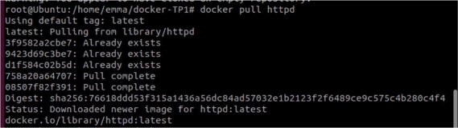

2. Vérifier que cette image est présente en local  

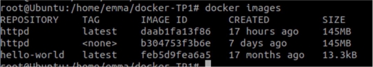

3. Créer un fichier index.html simple 

4. Démarrer un conteneur et servir la page html créée précédemment à l’aide d’un volume (option 

-v de docker run)  

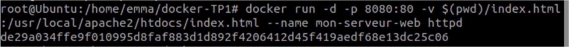

5. Supprimer le conteneur précédent et arriver au même résultat que précédemment à l’aide de la commande docker cp  

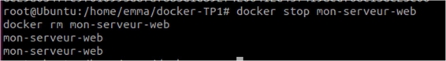

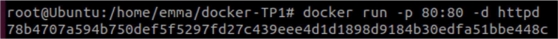

On copie l’index.html dans le conteneur :  

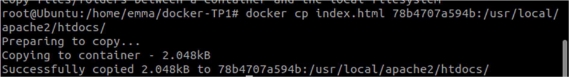

6. Builder une image  
1. A l’aide d’un Dockerfile, créer une image (commande docker build)  

Contenu du Dockerfile : 

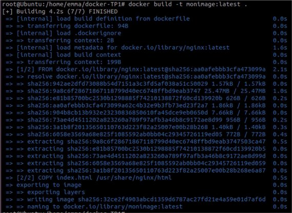

2. Exécuter cette nouvelle image de manière à servir la page html (commande docker run)  

3. Quelles différences observez-vous entre les procédures 5. et 6. ?  

La procédure 5 utilise un conteneur existant à partir de dockerHub alors que la 6 créer une nouvelle image à partir d’un docker file. 

Avantages et inconvénients de l’une et de l’autre méthode ? (Mettre en relation ce qui est observé avec ce qui a été présenté pendant le cours)  

Pour la procédure 5 : Avantages : 

Les images de serveur web sont facilement accessibles sur le Docker Hub. 

L'utilisation d'un volume permet de séparer le code de l'application de l'image de l'application, ce qui facilite la maintenance et la mise à jour de l'application. 

Inconvénients : 

L'utilisation de volumes peut rendre la configuration de l'application plus complexe, en particulier si l'on utilise des volumes pour plusieurs applications. 

Pour la procédure 6 : Avantages : 

La méthode est plus flexible que l'utilisation d'une image existante, car elle permet de personnaliser l'image selon les besoins de l'application. 

Les images peuvent être créées de manière reproductible, ce qui facilite la mise à jour et la maintenance de l'application. 

La méthode est portable, car l'image de l'application peut être déplacée facilement entre différents environnements. 

Inconvénients : 

La création d'une image peut être plus complexe et prendre plus de temps que l'utilisation d'une image existante.  La maintenance est aussi plus complexe, car il est nécessaire de mettre à jour régulièrement le Dockerfile. 

7. Utiliser une base de données dans un conteneur docker  
1. Récupérer les images mysql:5.7 et phpmyadmin/phpmyadmin depuis le Docker Hub  

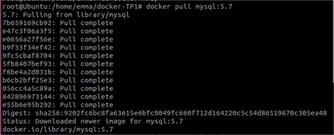

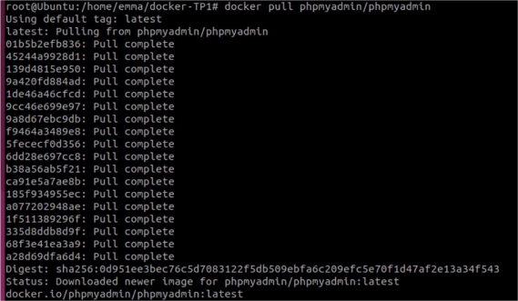

2. Exécuter deux conteneurs à partir des images et ajouter une table ainsi que quelques enregistrements dans la base de données à l’aide de phpmyadmin  

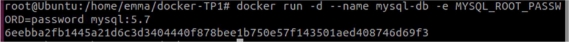

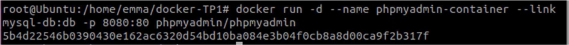

8. Faire la même chose que précédemment en utilisant un fichier docker-compose.yml  

Contenu du docker-compose.yml : 

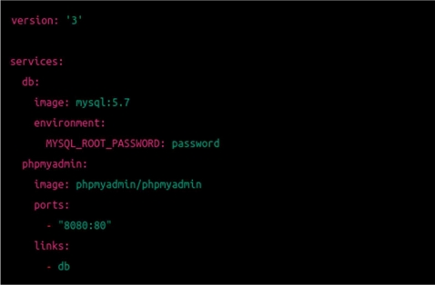

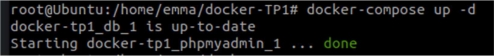

1. Qu’apporte le fichier docker-compose par rapport aux commandes docker run ? Pourquoi est-il intéressant ? (cf. ce qui a été présenté pendant le cours)  Le fichier docker compose permet de décrire les configurations de plusieurs conteneurs dans un seul fichier YML. Ce qui simplifie la gestion, la création et le déploiement dans le cas où il y a plusieurs conteneurs. ‘docker run’ lui ne permet de lancer qu’un seul fichier à la fois. 
1. Quel moyen permet de configurer (premier utilisateur, première base de données, mot de passe root, …) facilement le conteneur mysql au lancement ? 
1. En utilisant l’option -e ici,on donne le user, le mot de passe et la database.

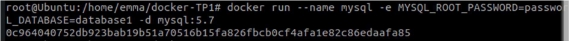

On peut aussi utiliser un fichier de configuration mysql, dans ce cas on lance la commande docker run de la façon suivante : 

docker run –name mysql -v /path/to/my.cnf:/etc/mysql/my.cnf -d mysql :5.7 

9. Observation de l’isolation réseau entre 3 conteneurs  
1. A l’aide de docker-compose et de l’image praqma/network-multitool disponible sur le Docker Hub créer 3 services (web, app et db) et 2 réseaux (frontend et backend). Les services web et db ne devront pas pouvoir effectuer de ping de l’un vers l’autre  

Contenu du docker-compose : 

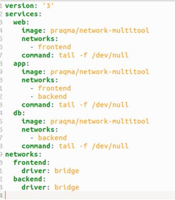

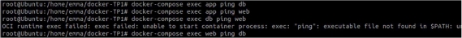

2. Quelles lignes du résultat de la commande docker inspect justifient ce comportement ? 

docker inspect permet de récupérer des informations sur le conteneur tel que les réseaux auquels le conteneurs est connecté 

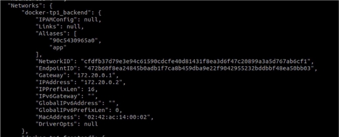

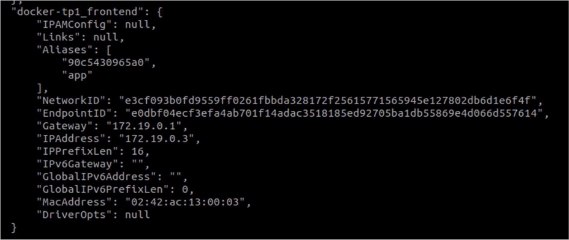

d.  Dans quelle situation réelles (avec quelles images) pourrait-on avoir cette configuration réseau ? Dans quel but ? Dans le cas ou un service de base données serait connecté à un réseau privé mais également à un réseau public. De cette façon, avoir des services isolés permette aux utilisateurs d’accéder aux services nécessaires en toute sécurité. 

Un autre cas serait un service web connecté à un réseau frontend pour communiquer avec un load balancer ainsi qu’un à un réseau backend pour communiquer avec une base de données. 
